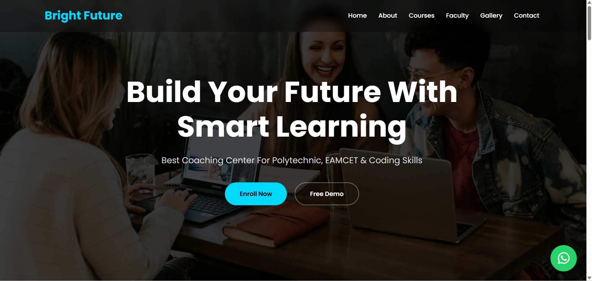
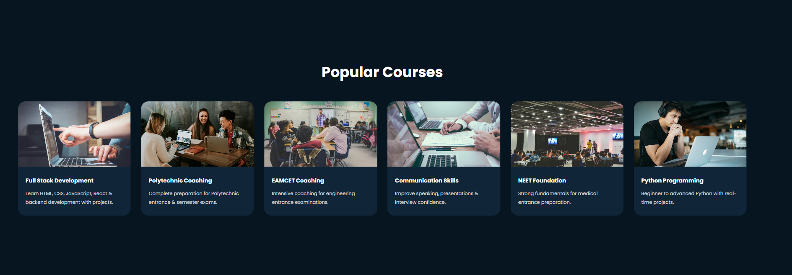
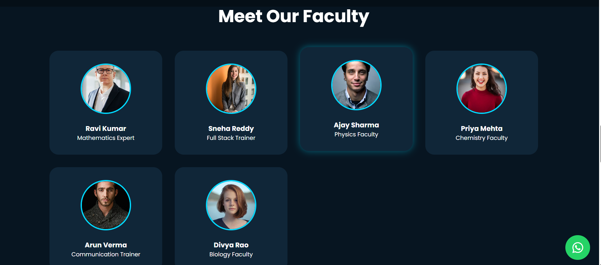
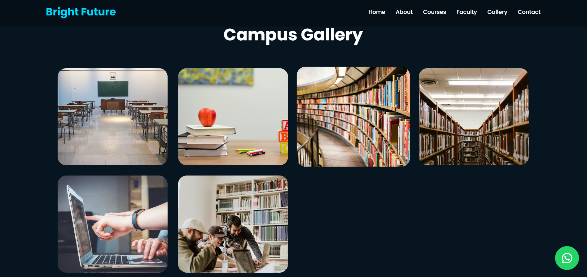
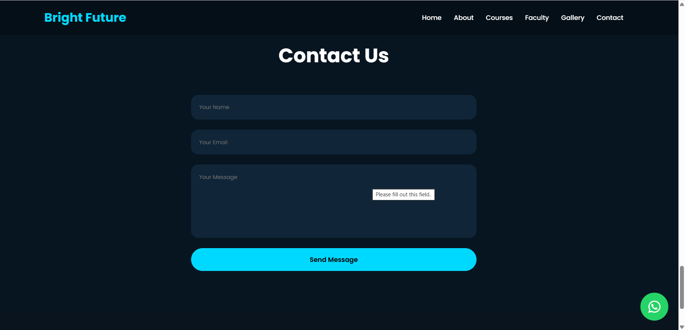

# Bright Future Coaching Center Website

A professional and responsive coaching center website developed for Future Interns Task-3 using HTML, CSS, JavaScript, Formspree, and Vercel.

---

# 🚀 Live Website

https://future-fs-03-theta-indol.vercel.app

---

# 📂 GitHub Repository

https://github.com/pravalika1910/FUTURE_FS_03

---

# Features

✅ Modern Responsive UI  
✅ Admission Popup Form  
✅ Contact Form Integration  
✅ Free Demo Class Video  
✅ Faculty Section  
✅ Courses Section  
✅ Campus Gallery  
✅ WhatsApp Contact Button  
✅ Smooth Scrolling  
✅ Professional Coaching Center Design  

---

# Technologies Used

## Frontend
- HTML5
- CSS3
- JavaScript

## Form Handling
- Formspree

## Deployment
- Vercel

---

# Project Screenshots

## Home Page

---

## Courses Section

---

## Faculty Section

---

## Gallery Section

---

## Contact Form

---

# Project Purpose

This project was created for a local coaching center to improve online visibility, student engagement, and digital admissions.

The website provides:
- Online admission support
- Course information
- Faculty details
- Demo class experience
- Easy communication system

---

# Author

Pravalika Gedela

Future Interns – Full Stack Web Development Internship